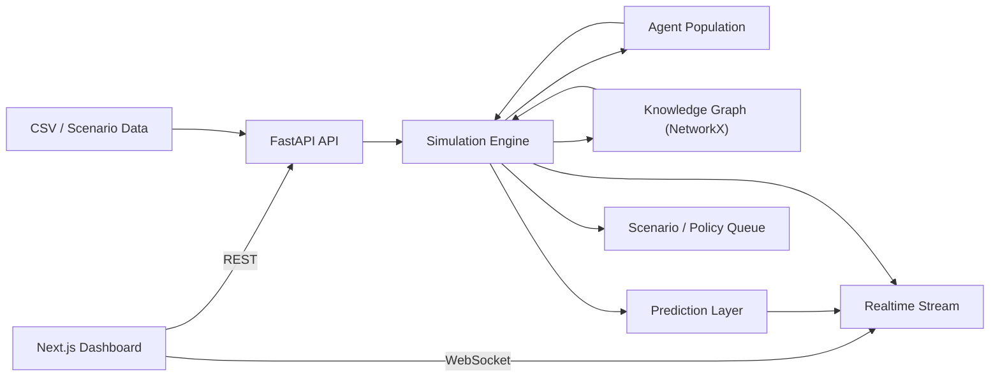
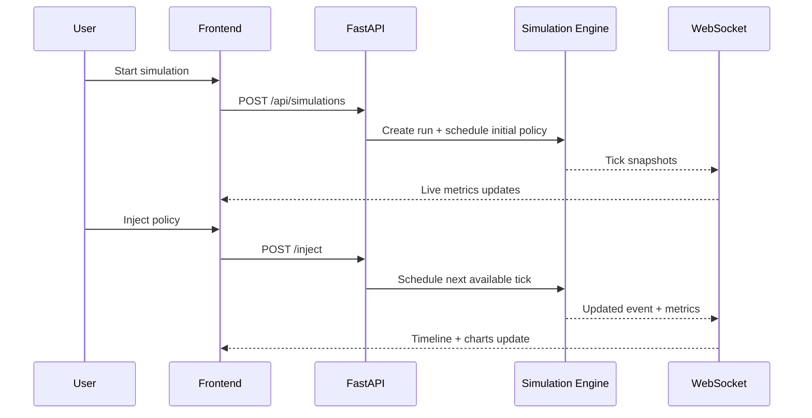

# K-ARK NationSim

K-ARK NationSim is a digital twin simulation MVP for policy experimentation. It models a clustered population of citizens, simulates how policies spread through society over time, and exposes the results through a real-time dashboard for scenario testing.

This project is designed as a portfolio-grade full-stack system that demonstrates:

- agent-based simulation
- real-time WebSocket delivery
- policy injection and intervention tracking
- knowledge-graph-style relationship modeling
- predictive analytics and opinion clustering
- modern FastAPI + Next.js product architecture

## What It Does

K-ARK NationSim lets you ask questions like:

- What happens if fuel prices rise by 20%?
- How does a universal basic income change trust and sentiment?
- What if we inject a custom policy midway through a running simulation?

The system simulates a representative population of Delhi citizens, applies policy shocks, lets agents influence one another, and streams updated metrics to the frontend.

## Core Features

- FastAPI backend with REST and WebSocket endpoints
- Clustered citizen-agent simulation with memory and influence links
- Prebuilt scenarios for fuel price increase, UBI, and education reform
- Custom policy creation and injection from the dashboard
- Real-time sentiment, trust, protest risk, and acceptance tracking
- Policy timeline showing scheduled and applied interventions
- NetworkX-based knowledge graph fallback
- Opinion clustering and short-horizon forecasting
- Docker-first local setup

## Architecture

### High-Level Diagram



### Runtime Flow



### Backend Architecture

- `backend/app/main.py`
  Exposes REST and WebSocket endpoints.
- `backend/app/simulation.py`
  Contains the main simulation engine, population builder, metrics collection, and policy scheduling.
- `backend/app/models.py`
  Defines API models, simulation snapshots, agent structures, and request payloads.
- `backend/app/graph.py`
  Maintains the NetworkX knowledge graph.
- `backend/app/llm.py`
  Provides cached narrative reaction generation logic.
- `backend/app/service.py`
  Wires data loading, engine initialization, and the WebSocket manager.

### Frontend Architecture

- `frontend/app/page.tsx`
  Main dashboard page and orchestration logic.
- `frontend/components/scenario-controls.tsx`
  Start/inject controls, custom policy form, and speed selection.
- `frontend/components/confirm-modal.tsx`
  In-page confirmation modal for starting or injecting policies.
- `frontend/components/event-timeline.tsx`
  Intervention history view for scheduled and applied policies.
- `frontend/components/sentiment-chart.tsx`
  Time series chart for sentiment and trust.
- `frontend/components/heatmap-canvas.tsx`
  Geographic sentiment heatmap.
- `frontend/components/network-clusters.tsx`
  Cluster summary cards from K-means results.

## Tech Stack

### Backend

- Python 3.11+
- FastAPI
- Uvicorn
- Pydantic
- NumPy
- Pandas
- scikit-learn
- NetworkX

### Frontend

- Next.js 14
- React
- TypeScript
- Tailwind CSS
- Chart.js
- react-use-websocket

### Dev / Delivery

- Docker
- Docker Compose

## Repository Structure

```text
backend/
  app/
  tests/
  .env.example
  requirements.txt

frontend/
  app/
  components/
  lib/
  .env.local.example
  package.json

data/
  delhi_agents.csv
  scenarios.json

docs/
  architecture.md
  deployment.md
```

## Environment Setup

### Backend Environment File

Copy [backend/.env.example](C:/Users/utkar/Desktop/Replica/backend/.env.example) to `backend/.env`.

Example variables:

- `OPENAI_API_KEY`
- `OLLAMA_BASE_URL`
- `SIM_DEFAULT_TICK_HOURS`
- `WS_BROADCAST_MS`

### Frontend Environment File

Copy [frontend/.env.local.example](C:/Users/utkar/Desktop/Replica/frontend/.env.local.example) to `frontend/.env.local`.

Example variables:

- `NEXT_PUBLIC_API_BASE_URL`
- `NEXT_PUBLIC_WS_URL`

## Running The Project

### Option 1: Docker Compose

This is the easiest and recommended way.

From the project root:

```bash
docker compose up --build
```

Services:

- Frontend: `http://localhost:3000`
- Backend: `http://localhost:8000`
- Health check: `http://localhost:8000/health`

### Option 2: Manual Run With Git Bash

#### Backend

```bash
cd /c/Users/utkar/Desktop/Replica/backend
cp .env.example .env
python -m venv .venv
source .venv/Scripts/activate
pip install -r requirements.txt
uvicorn app.main:app --reload
```

#### Frontend

```bash
cd /c/Users/utkar/Desktop/Replica/frontend
cp .env.local.example .env.local
npm install
npm run dev
```

### Option 3: Manual Run With PowerShell

#### Backend

```powershell
cd C:\Users\utkar\Desktop\Replica\backend
Copy-Item .env.example .env
python -m venv .venv
.venv\Scripts\Activate.ps1
pip install -r requirements.txt
uvicorn app.main:app --reload
```

#### Frontend

```powershell
cd C:\Users\utkar\Desktop\Replica\frontend
Copy-Item .env.local.example .env.local
npm install
npm run dev
```

## How To Use The Product

### 1. Start The App

Open [http://localhost:3000](http://localhost:3000).

### 2. Choose Simulation Speed

Use the `Simulation Speed` selector in the control panel. Slower ticks give you more time to inject policies.

### 3. Start A Simulation

You have two ways to start:

- `Preset Scenario`
  Start from one of the built-in scenarios.
- `Custom Policy`
  Start a brand-new run using your own policy definition.

### 4. Review The Confirmation Modal

Before starting or injecting, the dashboard opens a modal showing:

- selected scenario or policy
- current action
- timing details
- target tick or run speed

### 5. Monitor The Dashboard

While the simulation runs, the page updates:

- progress bar
- sentiment and trust chart
- protest risk
- acceptance rate
- regional heatmap
- opinion clusters
- forecast insight
- policy timeline

### 6. Inject Another Policy

Once the simulation is `running`, you can:

- inject another preset scenario
- inject a completely custom policy

The intervention is scheduled for the next available tick and appears in the `Policy Timeline`.

## Built-In Scenarios

Data source: [data/scenarios.json](C:/Users/utkar/Desktop/Replica/data/scenarios.json)

- `fuel_price_hike`
  Economic pressure scenario with negative sentiment and trust impact.
- `universal_basic_income`
  Economic support scenario with positive sentiment and trust effect.
- `education_reform`
  Social investment scenario with positive but smaller impact.

## Custom Policy Inputs

The dashboard supports these custom fields:

- `Policy Name`
- `Policy Description`
- `Policy Domain`
- `Target Groups`
- `Sentiment Shock`
- `Trust Shift`
- `Economic Stress`

Interpretation:

- `Sentiment Shock`
  Direct change to agent sentiment.
- `Trust Shift`
  Direct change to trust in government.
- `Economic Stress`
  Higher positive values reduce economic comfort; negative values improve it.

## API Reference

### `GET /health`

Returns service health.

### `GET /api/scenarios`

Returns the scenario catalog.

### `GET /api/compare`

Returns a simple comparison summary for built-in scenarios.

### `POST /api/simulations`

Starts a simulation.

Example preset start:

```json
{
  "name": "Delhi baseline",
  "scenario_id": "fuel_price_hike",
  "agent_count": 1000,
  "tick_hours": 6,
  "total_ticks": 48,
  "tick_delay_ms": 1000
}
```

Example custom start:

```json
{
  "name": "War scenario",
  "custom_policy": {
    "name": "War",
    "description": "War between countries",
    "domain": "social",
    "target_groups": ["driver", "student"],
    "sentiment_shock": -0.55,
    "trust_shift": -0.45,
    "economic_stress": 0.5
  },
  "agent_count": 1000,
  "tick_hours": 6,
  "total_ticks": 48,
  "tick_delay_ms": 1500
}
```

### `GET /api/simulations/{simulation_id}`

Returns the latest snapshot of a simulation.

### `POST /api/simulations/{simulation_id}/inject`

Injects a preset or custom policy into a running simulation.

Example custom injection:

```json
{
  "custom_policy": {
    "name": "Emergency Subsidy",
    "description": "Immediate relief package",
    "domain": "economic",
    "target_groups": ["student", "service"],
    "sentiment_shock": 0.25,
    "trust_shift": 0.18,
    "economic_stress": -0.2
  },
  "tick": 8
}
```

### `WS /ws`

Streams real-time simulation snapshots and intervention events to the dashboard.

## Data Model Summary

Each representative citizen agent contains:

- demographic persona
- location coordinates
- political/economic/social leanings
- risk tolerance
- sentiment
- economic status
- trust in government
- short-term and long-term memory
- influence links to neighboring agents

## Simulation Model Summary

For each tick, the engine:

1. applies scheduled events
2. updates affected agents
3. runs social influence interactions
4. recomputes aggregate metrics
5. sends a snapshot to connected clients

## Current Product UX

The dashboard currently includes:

- in-page confirmation modal
- speed selector
- live progress bar
- custom policy start and injection flow
- intervention timeline panel

## Running Useful Checks

### Backend Health

```bash
curl http://localhost:8000/health
```

### Docker Containers

```bash
docker ps
```

### Rebuild The App

```bash
docker compose up --build
```

### Run Backend Compile Check

```bash
python -m compileall backend/app
```

## Known Limitations

This is still an MVP. It is intentionally focused on product clarity and working simulation flow rather than full production scale.

Not fully implemented yet:

- PostgreSQL persistence
- Redis caching backend
- Neo4j integration
- Monte Carlo batch orchestration
- PDF reporting
- advanced policy authoring with sliders and validation
- production-grade auth / multi-user session management

## Troubleshooting

### Docker Engine Not Running

If `docker compose` fails with a pipe or engine error, start Docker Desktop first and verify:

```bash
docker info
```

### Frontend Loads But Simulation Does Not Start

Check:

- backend is reachable at `http://localhost:8000/health`
- `.env.local` points to the correct backend URL
- Docker containers are both up

### Policy Injection Is Disabled

Policy injection only works while a simulation is `running`. If the run is already `completed`, start another one.

## Project Value

This MVP demonstrates a strong combination of:

- simulation systems thinking
- AI-oriented product design
- realtime distributed UX
- full-stack implementation discipline

It is structured so you can keep extending it toward:

- persistent scenario libraries
- historical experiment comparisons
- richer policy editors
- multi-city digital twins

## Additional Documentation

- [Architecture Notes](C:/Users/utkar/Desktop/Replica/docs/architecture.md)
- [Deployment Notes](C:/Users/utkar/Desktop/Replica/docs/deployment.md)
- [Backend README](C:/Users/utkar/Desktop/Replica/backend/README.md)
- [Frontend README](C:/Users/utkar/Desktop/Replica/frontend/README.md)
